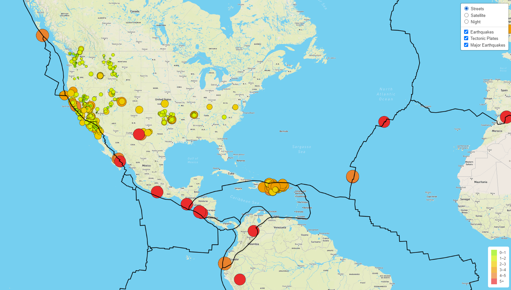

# Mapping Earthquakes with JavaScript and CSS

## Project Overview
Basil and Sadhana like how you created your earthquake map with two different maps and the earthquake overlay. Now, Basil and Sadhana would like to see the earthquake data in relation to the tectonic plates’ location on the earth, and they would like to see all the earthquakes with a magnitude greater than 4.5 on the map, and they would like to see the data on a third map.

### Features Added to Earthquake Map
1. Tectonic Plates Data
2. Major Earthquake Data
3. Additional Map for a 3-option view

### Map Details
1. Earthquakes will be visually represented by a circle and a color bsed on their magnitude.
2. Each earthquake will also have a popup marker for information on the location and magnitude.
3. A legend at the bottom of the map to show the color of the markers and their corresponding magnitude.
4. Lines on the map that reflect the tectonic plates locations.
5. A button at the top right corner to toggle between 3 map options and options to remove the major earthquakes, tectonic plates, or all eearthquakes data.

### Preview of Map

